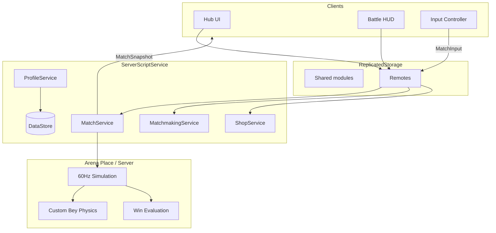

# Architecture

## High-level

## Authority model

| System | Authority |
|--------|-----------|
| Player profile, inventory, rolls | Server + DataStore |
| Match physics & win detection | Server (MatchService) |
| Bey positions between snapshots | Client interpolation |
| VFX, camera, UI | Client |
| ELO / BP changes | Server after validated match end |

Same principle as BeyWeb online: clients send **inputs only** (`steer`, `ability`, `tick`); server runs fixed `1/60` simulation.

## Places strategy

| Place | Purpose |
|-------|---------|
| **Hub** | Spawn, shops, mode select, leaderboards |
| **Arena** | Lightweight battle instances; TeleportService from hub/queue |

Use `ReserveServer` or dedicated arena places per match to isolate physics.

## Module map

### Shared (`ReplicatedStorage/Shared`)

| Module | BeyWeb source |
|--------|---------------|
| `BeyCatalog` | `js/game/beys.js` |
| `Stats` | `js/game/stats.js` |
| `Rules` | `js/game/rules.js` |
| `GameModes` | `js/game/modes.js` + extensions |
| `Elo` | New |
| `Progression` | New |

### Server

| Module | Responsibility |
|--------|----------------|
| `ProfileService` | Load/save player data, unlock checks |
| `MatchService` | Arena lifecycle, sim tick, snapshots |
| `MatchmakingService` | Queues, Elo bands, teleport |
| `ShopService` | Rolls, MarketplaceService receipts |

### Client

| Module | Responsibility |
|--------|----------------|
| `init.client.lua` | Bootstrap |
| `InputController` (TODO) | Steer + ability → MatchInput |
| `Interpolation` (TODO) | Snapshot blending (port `js/net/interpolation.js`) |
| `UI/*` (TODO) | Hub, select, HUD, shop |

## Networking

### Remotes

| Remote | Direction | Payload |
|--------|-----------|---------|
| `MatchInput` | C→S | `{ tick, steer: Vector2, ability: "power" \| "special" \| nil }` |
| `MatchSnapshot` | S→C | `{ tick, bodies[], spins[], abilities[] }` |
| `QueueRequest` | C→S/R | `{ mode, beyId }` → queue status or teleport |
| `ShopRoll` | C→S/R | `{ currency: "coins" \| "free" \| "robux" }` → roll result |
| `ProfileUpdated` | S→C | Full or partial profile patch |

Prefer `UnreliableRemoteEvent` for snapshots (latest frame wins).

## DataStore schema

Key: `player_{userId}`

See `ProfileService.defaultProfile()` for fields. Use ProfileStore pattern with session locking for production.

OrderedDataStore `BeyPointsLeaderboard` — key `userId`, value `beyPoints`.

## Physics porting notes

BeyWeb uses **Cannon-es** with custom bey-vs-bey resolver (no engine top-top contacts). Roblox equivalent:

1. Each bey = `BasePart` (or assembly) with `AlignOrientation` for spin visual
2. Custom clash detection in `Heartbeat` / fixed loop — do **not** rely on default part-part elasticity
3. Port constants from `reference/config.json`
4. KO pockets: ray/region check against `pocketAngles`
5. Center pull, steer force, spin decay — port formulas from `js/physics/top.js`, `steer.js`, `contact.js`

## Security checklist

- [ ] Validate owned bey before queue/match
- [ ] Rate-limit MatchInput (max 60/s)
- [ ] Server recomputes stats from equipped parts — never trust client stats
- [ ] ProcessReceipt idempotency for Robux rolls
- [ ] Sanitize tournament entry (BP + level + coins) server-side

## Testing

- Studio unit tests via TestService for `Stats`, `Rules`, `Elo`, `Progression`
- Load test: 2 players, 1000 snapshot frames, measure server memory
- Parity test: record BeyWeb match seed + inputs, compare outcomes after port
